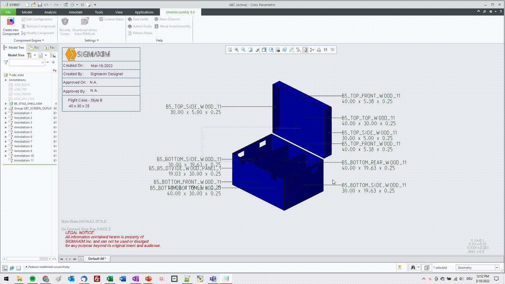
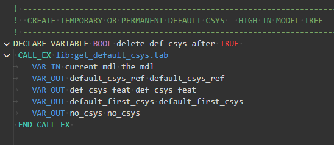
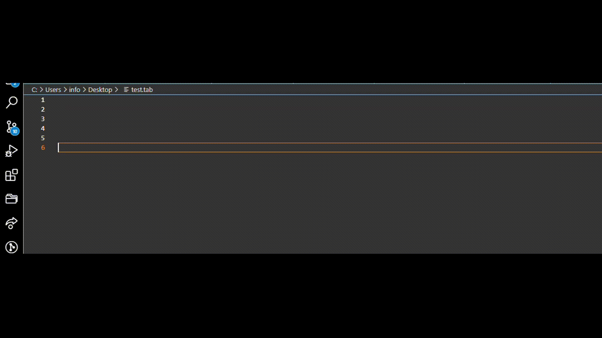
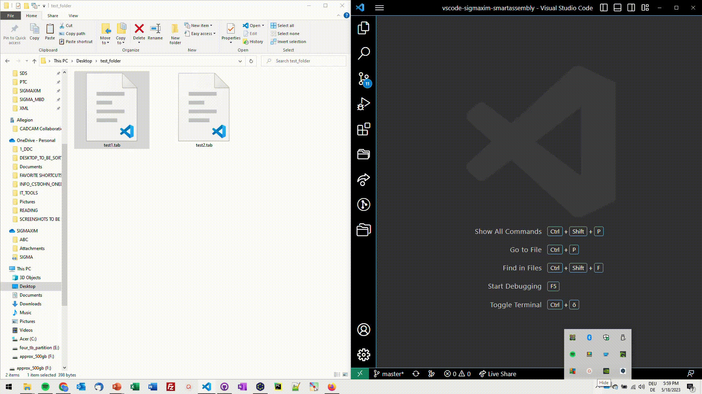

# Sigmaxim - Support for "Rules Perfect" automation projects.

Visual Studio Code plugin that adds comprehensive support for creating and managing PTC Creo automations with Sigmaxim Rules-Perfect products.

### Automation

## Features

### Syntax Highlighting 

### Autocompletion 

### Productivity Tools

## Extension Settings

This extension contributes the following settings to allow easy support of productivity commands:

* `sigmaxim-support.saChmPath`: SA Help CHM - Full Path.
* `sigmaxim-support.sdsChmPath`: SDS Help CHM - Full Path.
* `sigmaxim-support.saLibraryTestingFolderPath`: SA Library - Path to a Folder Dedicated to Quick Testing of Applications.
* `sigmaxim-support.saLibraryRootPath`: SA Library - Path to Root Library Path (containing Component_Engine folder).

## Release Notes

Current: Eliminated autoclosing for quotes.  Improved support of function syntax autocompletion to SA DATECODE 2023-08-24-01.

### 1.0.6

Sigmaxim "Rules Perfect" automation project support.

