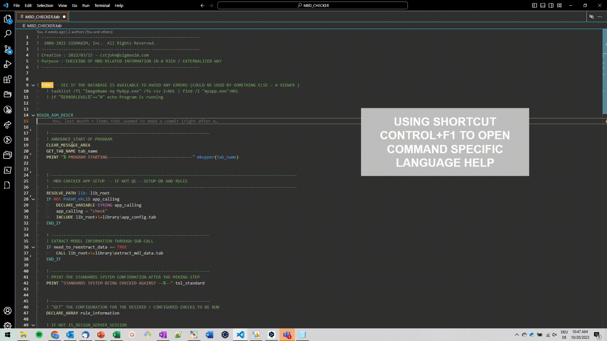

# Sigmaxim - Support for "Rules Perfect" automation projects.

Visual Studio Code plugin that adds comprehensive support for creating and managing PTC Creo automations with SIGMAXIM Rules-Perfect solutions.

## NO LONGER MAINTAINED

> Following my leaving Sigmaxim Inc. in Feb 2024, and given the proprietary nature of the language, I will no longer be actively maintaining this repo.  Please reach out if you would like to continue its development. - Cole St John

## Automation with SIGMAXIM SMARTASSEMBLY in CREO Parametric

Automation of tasks in PTC Creo Parametric software using SmartAssembly and SmartAssembly scripts.

## Features of Extension

### Syntax Highlighting 
Highlighting of SmartAssembly (.tab) syntax in scripts.

### Command-Specific Language Help 
Directly enter deeper, relevant .chm-based language help files based on current cursor location in script.

### Autocompletion 
Autocompletion of immediate script keywords based on language specifications - for .tab, sel_list.txt, config.pro, config.sup, .dtl, .cfg files, etc.

### Productivity Tools
Range of productivity tools - including...management of the linking file sel_list.txt (including creation and auto listing of all tab files or subdirectories in a path), as well as re-organization of sel_list files for improved readability, etc.

### Debugging Tools - NEW
New debugging tools - including...highlighting of program lines run (can be extremely helpful in visualization of control flow / visual cues to testing coverage).  

This particular feature relies on a formatted input : 
``program.tab: line, line, line
program.tab: line, line, line``
that can be produced using the 
``DEBUG_TAB_PERFORMANCE 0`` option.

## Extension Settings
This extension contributes the following settings to allow easy support of productivity commands:

* `sigmaxim-support.saChmPath`: SA Help CHM - Full Path.
* `sigmaxim-support.sdsChmPath`: SDS Help CHM - Full Path.
* `sigmaxim-support.saLibraryTestingFolderPath`: SA Library - Path to a Folder Dedicated to Quick Testing of Applications.
* `sigmaxim-support.saLibraryRootPath`: SA Library - Path to Root Library Path (containing Component_Engine folder).

## Release Notes

### NO LONGER MAINTAINED
As noted above - this repo is no longer maintained.

### 1.0.10/11/12/13
Added snippet and language highlighting support to SA 9.0.2 / 2023-12-21-01.

### 1.0.9
Added snippet and language highlighting support to SA 9.0.2 / 2023-10-04-01.

